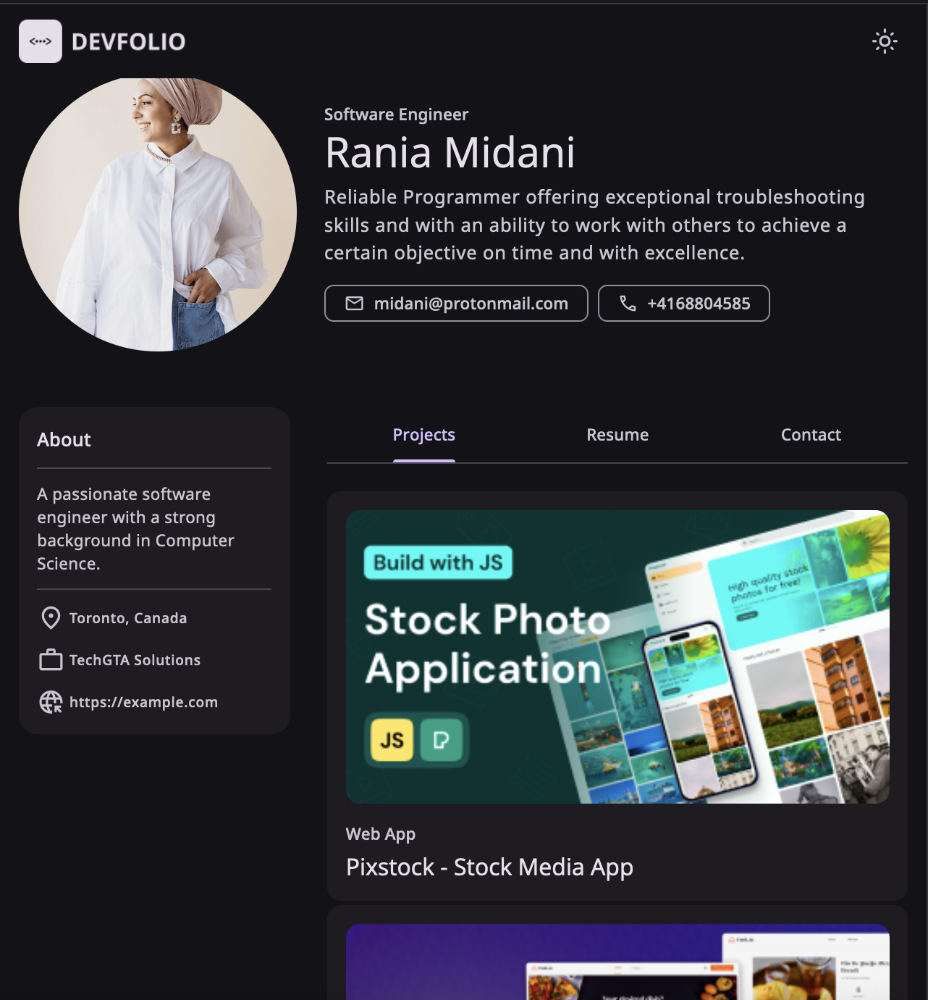
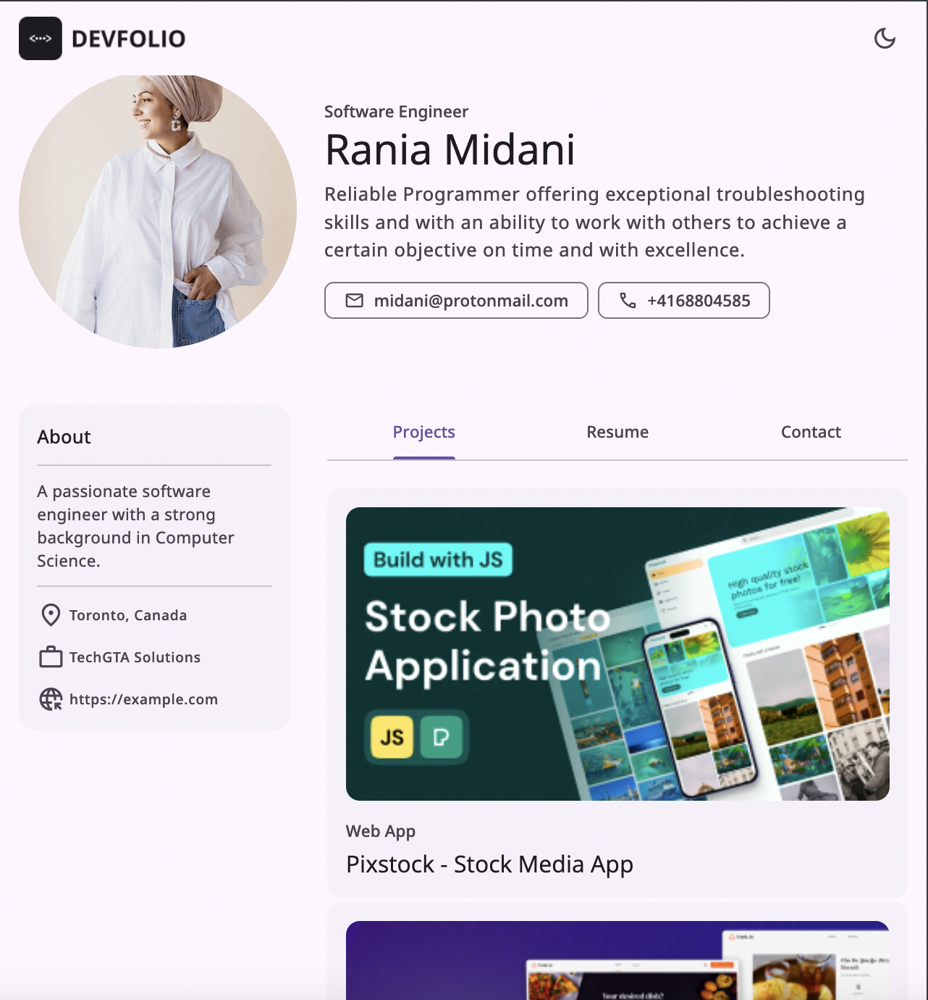
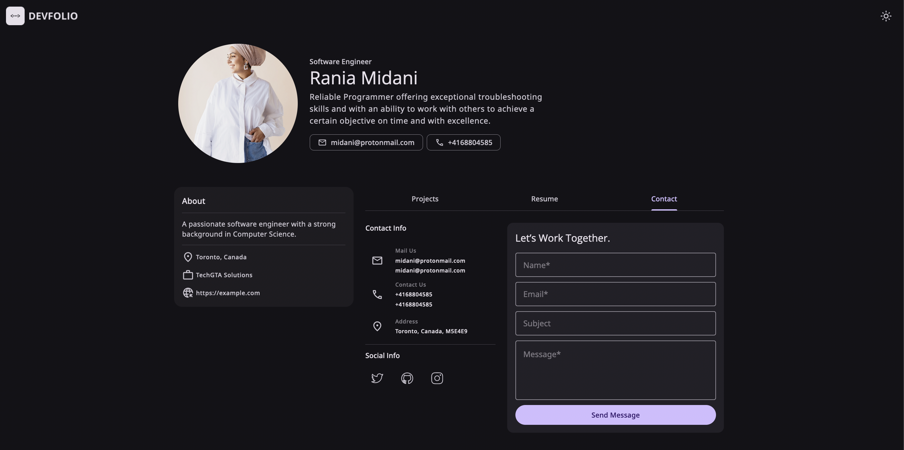

 <br />
  <br />

  <h2 align="center">Personal Portfolio Website</h2>

Responsive personal portfolio website. <br />Responsive for all devices, built using HTML, CSS, and JavaScript.

  </div>

<br />

### Demo Screeshots






### Prerequisites

Before you begin, ensure you have met the following requirements:

- [Git](https://git-scm.com/downloads 'Download Git') must be installed on your operating system.


### Run Locally

To run **Portfolio** locally, run this command on your git bash:

Linux and macOS:

```bash
sudo git clone https://github.com/moqdev/portfolio.git
```

Windows:

```bash
git clone https://github.com/moqdev/portfolio.git
```
